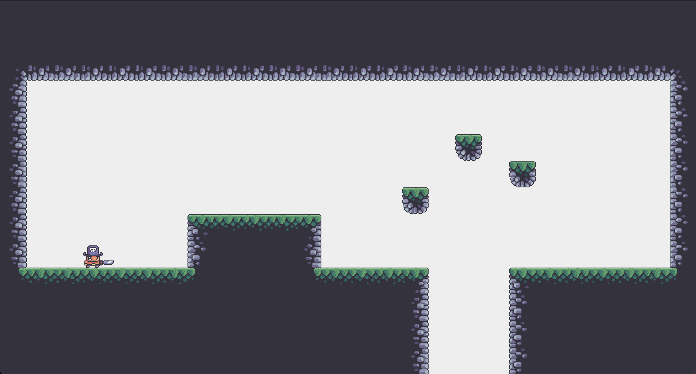

# 2DJavaGame

#Descrition
I'm working on a personal project to create a 2D game similar to Terraria, using Java. It's an adventure where you explore a vast world, battle monsters, and meet NPCs. The game is still in development, but I'm excited about bringing this interactive and exploratory world to life.

#Tech Stack
For this game, I'm using Java because it's versatile and reliable. To handle the graphics and make everything look good, I'm leveraging JavaFX. It's a great combo that lets me focus on crafting engaging gameplay and stunning visuals, making the game enjoyable and immersive.

